# Diagrama de Classes (UML) - PFC-BACKEND

```mermaid
classDiagram

namespace controller {
  class AuthController {
    -IAuthService authService
    +login(LoginRequestDTO) LoginPendenteResponseDTO
    +verificarCodigo(VerificarCodigoRequestDTO) LoginResponseDTO
    +esqueciSenha(EsqueciSenhaRequestDTO) void
    +redefinirSenha(RedefinirSenhaRequestDTO) void
  }

  class UsuarioController {
    -IUsuarioService usuarioService
    -AnonimizacaoService anonimizacaoService
    +criarUsuario(UsuarioRequestDTO) UsuarioResponseDTO
    +buscarPorId(UUID, Jwt) UsuarioResponseDTO
    +listar(...) PaginaDTO~UsuarioAdminResponseDTO~
    +atualizar(UUID, UsuarioAtualizacaoRequestDTO) UsuarioAdminResponseDTO
    +alterarAtivo(UUID, AlterarAtivoRequestDTO, Jwt) UsuarioAdminResponseDTO
    +solicitarAnonimizacao(Jwt) void
    +listarAnonimizacoesPendentes() List~AnonimizadorPendenteDTO~
    +anonimizar(UUID) void
  }

  class ExercicioController {
    -IExercicioService exercicioService
    +criarExercicio(ExercicioRequestDTO) ExercicioResponseDTO
    +listarExercicios(GrupoMuscularEnum) List~ExercicioResponseDTO~
    +buscarPorId(UUID) ExercicioResponseDTO
    +atualizarExercicio(UUID, ExercicioRequestDTO) ExercicioResponseDTO
    +excluirExercicio(UUID) void
  }

  class AuditoriaController {
    -IAuditoriaService auditoriaService
    -Clock clock
    +consultar(...) PaginaDTO~RegistroAuditoriaResponseDTO~
    +exportarCsv(...) byte[]
    +listarAcoes() List~OpcaoDTO~
    +listarRecursos() List~OpcaoDTO~
  }

  class DocumentoLegalController {
    -IDocumentoLegalService documentoLegalService
    +listarVigentes() List~DocumentoLegalResponseDTO~
    +buscarVigente(TipoDocumentoLegalEnum) DocumentoLegalResponseDTO
  }

  class EnderecoController {
    -IEnderecoService enderecoService
    +buscarPorCep(String) EnderecoResponseDTO
  }

  class MetricasController {
    -IMetricasService metricasService
    +calcularVolumeTreino(VolumeTreinoRequestDTO) VolumeTreinoResponseDTO
  }
}

namespace service {
  class IAuthService {
    <<interface>>
    +login(LoginRequestDTO) LoginPendenteResponseDTO
    +verificarCodigo(VerificarCodigoRequestDTO) LoginResponseDTO
    +esqueciSenha(EsqueciSenhaRequestDTO) void
    +redefinirSenha(RedefinirSenhaRequestDTO) void
  }

  class IUsuarioService {
    <<interface>>
    +criarUsuario(UsuarioRequestDTO) UsuarioResponseDTO
    +buscarPorId(UUID) UsuarioResponseDTO
    +listar(...) PaginaDTO~UsuarioAdminResponseDTO~
    +atualizar(UUID, UsuarioAtualizacaoRequestDTO) UsuarioAdminResponseDTO
    +alterarAtivo(UUID, boolean, UUID) UsuarioAdminResponseDTO
  }

  class IExercicioService {
    <<interface>>
    +criarExercicio(ExercicioRequestDTO) ExercicioResponseDTO
    +listarExercicios() List~ExercicioResponseDTO~
    +listarPorGrupoMuscular(GrupoMuscularEnum) List~ExercicioResponseDTO~
    +buscarPorId(UUID) ExercicioResponseDTO
    +atualizarExercicio(UUID, ExercicioRequestDTO) ExercicioResponseDTO
    +excluirExercicio(UUID) void
  }

  class IAuditoriaService {
    <<interface>>
    +registrar(AcaoAuditoriaEnum, RecursoAuditoriaEnum, UUID) void
    +registrar(AcaoAuditoriaEnum, RecursoAuditoriaEnum, UUID, UUID) void
    +consultar(...) PaginaDTO~RegistroAuditoriaResponseDTO~
    +exportarCsv(...) String
    +descartarAntigos() long
  }

  class IDocumentoLegalService {
    <<interface>>
    +listarVigentes() List~DocumentoLegalResponseDTO~
    +buscarVigente(TipoDocumentoLegalEnum) DocumentoLegalResponseDTO
    +versaoVigente(TipoDocumentoLegalEnum) String
  }

  class IEnderecoService {
    <<interface>>
    +buscarPorCep(String) EnderecoResponseDTO
  }

  class IMetricasService {
    <<interface>>
    +calcularVolumeTreino(VolumeTreinoRequestDTO) VolumeTreinoResponseDTO
  }

  class IAnonimizacaoService {
    <<interface>>
    +solicitar(UUID) void
    +listarPendentes() List~AnonimizadorPendenteDTO~
    +anonimizar(UUID) void
  }

  class ICodigoVerificacaoService {
    <<interface>>
    +gerarCodigo(UsuarioEntity, TipoCodigoEnum) String
    +validarCodigo(UsuarioEntity, TipoCodigoEnum, String) void
    +validadeEmSegundos(TipoCodigoEnum) int
  }

  class IEmailService {
    <<interface>>
    +enviar(String, String, String) void
    +enviarAssincrono(String, String, String) void
  }
}

namespace service_impl {
  class AuthService {
    -IUsuarioRepository usuarioRepository
    -ICodigoVerificacaoService codigoVerificacaoService
    -IEmailService emailService
    -IAuditoriaService auditoriaService
    +login(LoginRequestDTO) LoginPendenteResponseDTO
    +verificarCodigo(VerificarCodigoRequestDTO) LoginResponseDTO
    +esqueciSenha(EsqueciSenhaRequestDTO) void
    +redefinirSenha(RedefinirSenhaRequestDTO) void
  }

  class UsuarioService {
    -IUsuarioRepository usuarioRepository
    -UsuarioMapper usuarioMapper
    -IDocumentoLegalService documentoLegalService
    -IAuditoriaService auditoriaService
    +criarUsuario(UsuarioRequestDTO) UsuarioResponseDTO
    +buscarPorId(UUID) UsuarioResponseDTO
    +listar(...) PaginaDTO~UsuarioAdminResponseDTO~
    +atualizar(UUID, UsuarioAtualizacaoRequestDTO) UsuarioAdminResponseDTO
    +alterarAtivo(UUID, boolean, UUID) UsuarioAdminResponseDTO
  }

  class ExercicioService {
    -IExercicioRepository exercicioRepository
    -ExercicioMapper exercicioMapper
    -IAuditoriaService auditoriaService
    +criarExercicio(ExercicioRequestDTO) ExercicioResponseDTO
    +listarExercicios() List~ExercicioResponseDTO~
    +atualizarExercicio(UUID, ExercicioRequestDTO) ExercicioResponseDTO
    +excluirExercicio(UUID) void
  }

  class AuditoriaService {
    -IRegistroAuditoriaRepository registroAuditoriaRepository
    -IUsuarioRepository usuarioRepository
    +registrar(...) void
    +consultar(...) PaginaDTO~RegistroAuditoriaResponseDTO~
    +exportarCsv(...) String
    +descartarAntigos() long
  }

  class DocumentoLegalService {
    -IDocumentoLegalRepository documentoLegalRepository
    -DocumentoLegalMapper documentoLegalMapper
    +listarVigentes() List~DocumentoLegalResponseDTO~
    +buscarVigente(TipoDocumentoLegalEnum) DocumentoLegalResponseDTO
    +versaoVigente(TipoDocumentoLegalEnum) String
  }

  class EnderecoService {
    -ViaCepClient viaCepClient
    +buscarPorCep(String) EnderecoResponseDTO
  }

  class MetricasService {
    -IExercicioRepository exercicioRepository
    +calcularVolumeTreino(VolumeTreinoRequestDTO) VolumeTreinoResponseDTO
  }

  class AnonimizacaoService {
    -IUsuarioRepository usuarioRepository
    -IAuditoriaService auditoriaService
    +solicitar(UUID) void
    +listarPendentes() List~AnonimizadorPendenteDTO~
    +anonimizar(UUID) void
  }

  class CodigoVerificacaoService {
    +gerarCodigo(UsuarioEntity, TipoCodigoEnum) String
    +validarCodigo(UsuarioEntity, TipoCodigoEnum, String) void
    +validadeEmSegundos(TipoCodigoEnum) int
  }

  class EmailService {
    +enviar(String, String, String) void
    +enviarAssincrono(String, String, String) void
  }
}

namespace repository {
  class IUsuarioRepository { <<interface>> }
  class IExercicioRepository { <<interface>> }
  class IRegistroAuditoriaRepository { <<interface>> }
  class IDocumentoLegalRepository { <<interface>> }
}

namespace mapper {
  class UsuarioMapper { <<interface>> }
  class ExercicioMapper { <<interface>> }
  class DocumentoLegalMapper { <<interface>> }
}

namespace entity {
  class UsuarioEntity {
    +UUID id
    +String nomeCompleto
    +String email
    +String senhaHash
    +PapelUsuarioEnum papel
    +LocalDate dataNascimento
    +String cref
    +FormacaoEnum formacao
    +TipoCodigoEnum codigoTipo
    +Boolean ativo
    +LocalDateTime anonimizadoEm
  }

  class ExercicioEntity {
    +UUID id
    +String nome
    +GrupoMuscularEnum grupoMuscular
    +NivelDificuldadeEnum nivel
    +String descricaoExecucao
    +String equipamento
  }

  class DocumentoLegalEntity {
    +UUID id
    +TipoDocumentoLegalEnum tipo
    +String versao
    +String texto
    +LocalDateTime vigenteDesde
  }

  class RegistroAuditoriaEntity {
    +UUID id
    +LocalDateTime ocorridoEm
    +AcaoAuditoriaEnum acao
    +RecursoAuditoriaEnum recursoTipo
    +UUID recursoId
    +UUID usuarioId
  }
}

namespace enums {
  class PapelUsuarioEnum {
    <<enumeration>>
    ALUNO
    PROFESSOR
    ADMINISTRADOR
  }

  class FormacaoEnum {
    <<enumeration>>
    BACHARELADO
    LICENCIATURA
  }

  class TipoCodigoEnum {
    <<enumeration>>
    MFA
    REDEFINICAO_SENHA
  }

  class GrupoMuscularEnum {
    <<enumeration>>
    PEITO
    COSTAS
    OMBRO
    BICEPS
    TRICEPS
    PERNA
    GLUTEO
    ABDOMEN
  }

  class NivelDificuldadeEnum {
    <<enumeration>>
    INICIANTE
    INTERMEDIARIO
    AVANCADO
  }

  class AcaoAuditoriaEnum {
    <<enumeration>>
    CRIADO
    LIDO
    ATUALIZADO
    EXCLUIDO
    LOGIN_REALIZADO
    LOGIN_FALHOU
    MFA_FALHOU
    ANONIMIZADO
  }

  class RecursoAuditoriaEnum {
    <<enumeration>>
    USUARIO
    EXERCICIO
    AUDITORIA
    ARTIGO
  }

  class TipoDocumentoLegalEnum {
    <<enumeration>>
    TERMOS_USO
    POLITICA_PRIVACIDADE
  }
}

namespace integration {
  class ViaCepClient {
    +buscar(String) ViaCepResponseDTO
  }

  class ViaCepResponseDTO {
    <<record>>
  }
}

namespace exception {
  class TratadorDeErros {
    +tratarNaoEncontrado(...) ApiErroDTO
    +tratarConflito(...) ApiErroDTO
    +tratarRegraDeNegocio(...) ApiErroDTO
    +tratarCredenciaisInvalidas(...) ApiErroDTO
    +tratarErroInesperado(...) ApiErroDTO
  }

  class TratadorDeErrosDeSeguranca {
    +commence(...) void
    +handle(...) void
  }

  class ConflitoException
  class CredenciaisInvalidasException
  class LimiteDeTentativasException
  class RecursoNaoEncontradoException
  class RegraDeNegocioException
  class ServicoIndisponivelException
}

%% implementações
AuthService ..|> IAuthService
UsuarioService ..|> IUsuarioService
ExercicioService ..|> IExercicioService
AuditoriaService ..|> IAuditoriaService
DocumentoLegalService ..|> IDocumentoLegalService
EnderecoService ..|> IEnderecoService
MetricasService ..|> IMetricasService
AnonimizacaoService ..|> IAnonimizacaoService
CodigoVerificacaoService ..|> ICodigoVerificacaoService
EmailService ..|> IEmailService

%% herança
ConflitoException --|> RuntimeException
CredenciaisInvalidasException --|> RuntimeException
LimiteDeTentativasException --|> RuntimeException
RecursoNaoEncontradoException --|> RuntimeException
RegraDeNegocioException --|> RuntimeException
ServicoIndisponivelException --|> RuntimeException

%% dependências de camadas
AuthController --> IAuthService
UsuarioController --> IUsuarioService
UsuarioController --> AnonimizacaoService
ExercicioController --> IExercicioService
AuditoriaController --> IAuditoriaService
DocumentoLegalController --> IDocumentoLegalService
EnderecoController --> IEnderecoService
MetricasController --> IMetricasService

AuthService --> IUsuarioRepository
AuthService --> ICodigoVerificacaoService
AuthService --> IEmailService
AuthService --> IAuditoriaService
UsuarioService --> IUsuarioRepository
UsuarioService --> UsuarioMapper
UsuarioService --> IDocumentoLegalService
UsuarioService --> IAuditoriaService
ExercicioService --> IExercicioRepository
ExercicioService --> ExercicioMapper
ExercicioService --> IAuditoriaService
AuditoriaService --> IRegistroAuditoriaRepository
AuditoriaService --> IUsuarioRepository
DocumentoLegalService --> IDocumentoLegalRepository
DocumentoLegalService --> DocumentoLegalMapper
EnderecoService --> ViaCepClient
MetricasService --> IExercicioRepository
AnonimizacaoService --> IUsuarioRepository
AnonimizacaoService --> IAuditoriaService

IUsuarioRepository ..> UsuarioEntity : gerencia
IExercicioRepository ..> ExercicioEntity : gerencia
IRegistroAuditoriaRepository ..> RegistroAuditoriaEntity : gerencia
IDocumentoLegalRepository ..> DocumentoLegalEntity : gerencia

UsuarioMapper ..> UsuarioEntity
ExercicioMapper ..> ExercicioEntity
DocumentoLegalMapper ..> DocumentoLegalEntity

%% enum/entidade
UsuarioEntity "1" --> "1" PapelUsuarioEnum
UsuarioEntity "0..1" --> "0..1" FormacaoEnum
UsuarioEntity "0..1" --> "0..1" TipoCodigoEnum
ExercicioEntity "1" --> "1" GrupoMuscularEnum
ExercicioEntity "1" --> "1" NivelDificuldadeEnum
DocumentoLegalEntity "1" --> "1" TipoDocumentoLegalEnum
RegistroAuditoriaEntity "1" --> "1" AcaoAuditoriaEnum
RegistroAuditoriaEntity "0..1" --> "0..1" RecursoAuditoriaEnum

ViaCepClient ..> ServicoIndisponivelException
EnderecoService ..> RecursoNaoEncontradoException
EnderecoService ..> RegraDeNegocioException
TratadorDeErrosDeSeguranca ..|> AuthenticationEntryPoint
TratadorDeErrosDeSeguranca ..|> AccessDeniedHandler

note for RegistroAuditoriaEntity "usuarioId e recursoId são UUIDs; vínculo com UsuarioEntity/Recurso é inferido por convenção, não por FK JPA explícita."
```

Legenda rápida:
- Relações `-->` representam uso/dependência direta (injeção de dependência, chamada de serviço ou colaboração).
- Cardinalidades (`1`, `0..1`) foram inferidas apenas quando o código e as anotações indicam obrigatoriedade/nulidade de forma explícita.
- O diagrama foca o código de produção (`src/main/java`) e consolida métodos/atributos relevantes para legibilidade.
